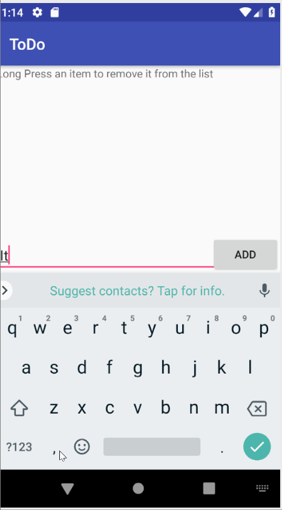

# Pre-work - *Simple Todo* 

**Simple ToDo App** is an android app that allows building a todo list and basic todo items management functionality including adding new items, editing and deleting an existing item.

Time spent: approximately **4** hours spent in total

## User Stories

The following **required** functionality is completed:

* [x] User can **successfully add and remove items** from the todo list
* [x] User can **tap a todo item in the list and bring up an edit screen for the todo item** and then have any changes to the text reflected in the todo list.
* [x] User can **persist todo items** and retrieve them properly on app restart

## Video Walkthrough

Here's a walkthrough of implemented user stories:

GIF created with [LiceCap](http://www.cockos.com/licecap/).

## Project Analysis

**Question 1:** "What are your reactions to the Android app development platform so far? Compare and contrast Android's approach to layouts and user interfaces in past platforms you've used."

**Answer:** [I was pleased to see how user friendly the Android app develpment platform is. There are many libraries available that provide a lot of useful functionality. I also really appreciated how well the layout editor integrates with the code in the .xml layout file. Unlike a different mobile app development platform I've used in the past, no additional steps are required in order to link the element to the code after adding a UI element, which makes it simple and easy to work with.].

**Question 2:** "Take a moment to reflect on the `ArrayAdapter` used in your pre-work. How would you describe an adapter in this context and what is its function in Android? Why do you think the adapter is important? Explain the purpose of the `convertView` in the `getView` method of the `ArrayAdapter`."

**Answer:** [The ArrayAdapter serves an import role by being the go-between between the java Array object, and the list in the view. This is important because the Array Object needs to be able to be interpreted by the View so that it can be displayed to the user.
In the getView method of ArrayAdapter, convertView represents the view that will hold the Arraylist object that the adapter converted to a View item to be used by the ListView  ].

## License

    Copyright 2018

    Licensed under the Apache License, Version 2.0 (the "License");
    you may not use this file except in compliance with the License.
    You may obtain a copy of the License at

        http://www.apache.org/licenses/LICENSE-2.0

    Unless required by applicable law or agreed to in writing, software
    distributed under the License is distributed on an "AS IS" BASIS,
    WITHOUT WARRANTIES OR CONDITIONS OF ANY KIND, either express or implied.
    See the License for the specific language governing permissions and
    limitations under the License.
